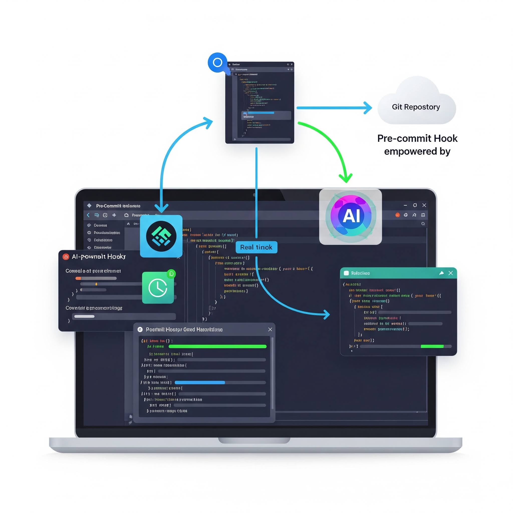

# BQ SQL Code Checker Demo



# Pre-commit Hook: AI SQL Code Reviewer

This is a pre-commit hook configuration that integrates an AI-powered BigQuery (BQ) SQL code reviewer into your development workflow. When you attempt to commit files, this hook will automatically trigger the `ai_code_reviewer.py` script to analyze your SQL code.

## Purpose

The primary goal of this hook is to:

*   **Automate Code Quality Checks:** Ensure that all BigQuery SQL code adheres to predefined standards and best practices before it's committed.
*   **Leverage AI for Feedback:** Utilize Google's Generative AI models to provide intelligent, context-aware feedback on SQL queries.
*   **Improve Developer Productivity:** Catch potential issues early in the development cycle, reducing the need for manual review of basic SQL quality.

## Prerequisites

To use this pre-commit hook, you must have:

1.  **`pre-commit` installed**: If not already installed, you can install it via pip:
    ```bash
    pip install pre-commit
    ```
2.  **AI SQL Code Reviewer Script**: The `ai_code_reviewer.py` script must be present in your repository.
3.  **System Context and Prompt Files**: The `ai_code_reviewer.py` script relies on two essential files in the same directory:
    *   `system_context.md`: Contains the AI's operational context, coding standards, and best practices.
    *   `system_prompt.md`: Defines the specific instructions for the AI review of each SQL file.
4.  **Google Cloud Project & Authentication**:
    *   Your Google Cloud project must be set up and accessible.
    *   You need to be authenticated to Google Cloud (e.g., via `gcloud auth application-default login`).
5.  **SQL Files**: The SQL files to be reviewed should be located in the directory specified in the `args` of this hook (defaulting to `./sql` in this configuration).

## Configuration (`.pre-commit-config.yaml`)

This hook is defined within your `.pre-commit-config.yaml` file.

```yaml
# Example .pre-commit-config.yaml
repos:
  - repo: local
    hooks:
      - id: bq-code-review
        name: AI SQL Code Review
        entry: python3 ai_code_reviewer.py
        additional_dependencies:
          - google-genai
        language: python
        pass_filenames: false
        args:
          - '--project'
          - 'xxx-sbx-xx-upbeat-xxxx'  # **Replace with your GCP Project ID**
          - '--location'
          - 'europe-west2'  # **Replace with your GCP Location**
          - '--sql_dir'
          - './sql'  # **Ensure this matches your SQL file directory**
        types: [sql]
        exclude_types:
```

Output
For each .sql file processed, a corresponding .md file will be created in the same directory. This markdown file will contain the AI's code review feedback, along with the generation timestamp and the time taken for the review.


# AI-Powered BQ SQL Code Reviewer

This script utilizes Google's Generative AI (GenAI) models to automate the review of BigQuery (BQ) SQL code. It's designed to integrate into a code review workflow, providing intelligent feedback based on predefined coding standards and best practices.

## Features

*   **AI-Driven Code Analysis:** Leverages powerful GenAI models to analyze SQL code for adherence to best practices, style guidelines, and potential issues.
*   **Contextual Review:** Uses a `system_context.md` file to provide the AI with specific coding standards, project-specific requirements, or general SQL best practices.
*   **Customizable Prompts:** Employs a `system_prompt.md` file to define the specific instructions for the AI review, allowing for tailored feedback requests.
*   **Batch Processing:** Scans a specified directory for `.sql` files and processes them sequentially.
*   **Markdown Reporting:** Generates a detailed QA report in Markdown format (`.md`) for each reviewed SQL file, named after the original SQL file (e.g., `your_query.sql` becomes `your_query.md`).
*   **Configurable:** Allows users to specify the GCP Project ID, GCP location, and the directory containing SQL files via command-line arguments.
*   **Performance Tracking:** Records and appends the time taken for each review to the generated report.
*   **Error Handling:** Includes robust error handling for file operations and GenAI client initialization.

## Prerequisites

Before you can run this script, ensure you have the following:

1.  **Python 3.7+**: Installed on your system.
2.  **Google Cloud SDK**: Authenticated and configured with your GCP project.
3.  **Google GenAI Library**: Installed via pip:
    ```bash
    pip install google-generativeai
    ```
4.  **`system_context.md`**: A markdown file in the same directory as the script, containing the system-level instructions, coding standards, and best practices for the AI.
5.  **`system_prompt.md`**: A markdown file in the same directory as the script, containing the specific prompt for the AI to use when reviewing each SQL file. This prompt can use `{filename}` as a placeholder for the current file being reviewed.

## Setup

1.  **Create `system_context.md`**:
    Define your project's SQL coding standards, best practices, performance considerations, and any other guidelines you want the AI to follow.

    *Example `system_context.md`*:
    ```markdown
    You are an expert SQL code reviewer specializing in BigQuery.
    Your goal is to ensure that all SQL code submitted is efficient, readable, maintainable, and follows best practices.
    Focus on:
    - Query performance (e.g., avoiding full table scans where possible, proper use of partitioning and clustering).
    - Readability and adherence to a consistent style guide.
    - Correctness and potential error handling.
    - Security considerations (e.g., avoiding hardcoded credentials, proper data access patterns).
    - BigQuery specific optimizations.
    Provide constructive feedback with specific examples and suggestions for improvement.
    If the code is well-written, please state that clearly.
    ```

2.  **Create `system_prompt.md`**:
    Define the specific task for the AI. This prompt will be combined with the SQL code.

    *Example `system_prompt.md`*:
    ```markdown
    Please review the following BigQuery SQL code for the file named '{filename}'.
    Provide a detailed code review, focusing on the guidelines provided in the system context.
    Your output should be a markdown formatted report, suitable for a code review comment.
    ```

3.  **Place SQL Files**:
    Create a directory (e.g., `sql_scripts` or `./sql`) and place all the `.sql` files you want to review inside it.

## Usage

Run the script from your terminal using the following command structure:

```bash
python ai_code_reviewer.py --sql_dir <path_to_sql_files> --project <gcp_project_id> --location <gcp_location>
```

# Makefile for Pre-commit Hook Management

This Makefile provides convenient commands to manage and run pre-commit hooks, specifically focusing on a `bq-code-review` hook within your project.

## Prerequisites

Before using this Makefile, ensure you have the following installed:

*   **pre-commit:** If you don't have it installed, you can typically install it via pip:
    ```bash
    pip install pre-commit
    ```
*   **Project Configuration:** Your project must have a `.pre-commit-config.yaml` file in the root directory that is correctly configured to include the `bq-code-review` hook.

## Available Commands

Here are the commands you can run using `make`:

*   **`make all` or `make`**:
    *   **Description:** Displays this help message. It's the default target when no specific target is provided.

*   **`make qa`**:
    *   **Description:** Explicitly runs the `bq-code-review` pre-commit hook on all files in your repository. This is useful for a manual check of your code quality before committing.

*   **`make setup`**:
    *   **Description:** Installs the pre-commit hooks for your repository locally and then updates them to their latest versions as defined in your `.pre-commit-config.yaml`. This ensures you are using the most up-to-date hook configurations.

*   **`make ec`**:
    *   **Description:** Creates an empty commit with the message "Empty-Commit". This is a common way to trigger the pre-commit hooks without making any actual code changes, allowing you to verify that the hooks are functioning correctly.

*   **`make help`**:
    *   **Description:** Displays this detailed help message, outlining all available commands and their purpose.

## Usage Example

1.  **Install and update hooks:**
    ```bash
    make setup
    ```

2.  **Run the code review hook:**
    ```bash
    make qa
    ```

3.  **Test hooks with an empty commit:**
    ```bash
    make ec
    ```

4.  **Get help:**
    ```bash
    make help
    ```
